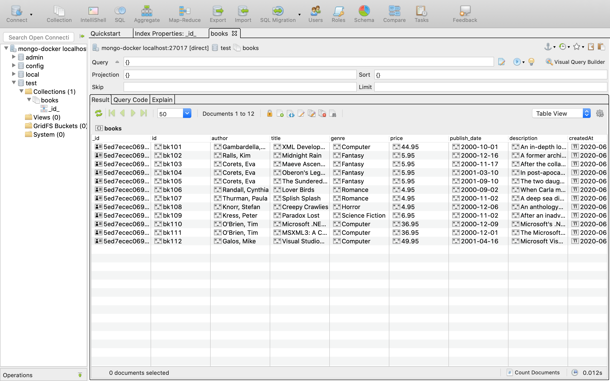

# XML PARSER USING JAVASCRIPT

The aim of the project is to read an **xml** file (stored locally).
It then parses through the xml, converts it to JSON and ultimately stores the data as a
collection into a mongoDB Database. 

## Module used:
```
xml2js
```

# Database screenshot
 </img>


# Use of docker
A mongo docker container has been used to ease the use of the database locally.

# Running the program
 
``` 
docker-compose up --build
```

This will build up the node container and the mongoDB container on port 27017

**It uses a validation module to ensure the schema rules are followed and enforced, before saving XML Parsed data into the database**

The xml file that is parsed is ```book.xml```. 
A file containing information on various books


